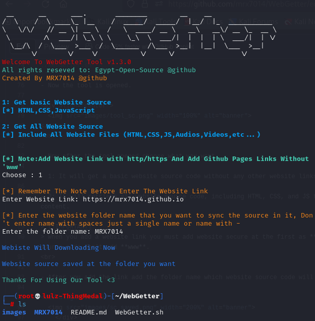

<div align="center">
  
    </div>
<div align="center">
  
**An open source prjkt allowed you to get any website source code in a few minutes**
<br>

# V1.0.0 released!
</div>
<br>
<div align="center">
  
**Developed and brought to you by Team Egypt Open Source**
</div>

<div align="center">
  
<a href="https://www.buymeacoffee.com/mrx7014"></a>
</div>
<br>

<div align="center">

**Let's know how to use this**
</div>

<br>

# 🛠 Requirements:

- Any linux system or termux.

> We recommended to use this free server to test this tool,Check this server form <a href="https://www.github.com/mrx7014/SSH-KaliLinux">SSH Kali Linux</a>
>

<br>

# ⚙️ Installation

- First install wget
```sh
sudo apt install wget
```
- After it finished now clone tool
```sh
curl https://raw.githubusercontent.com/Egypt-Open-Source/WebGetter/main/web_getter.sh >> web_getter.sh
```
<div align="center">
  
**Now tool and requirements is done,Let's know how to use the tool**
</div>

<br>

- First give the tool permissions
```sh
chmod +x web_getter.sh
```
After this type this command to open tool
```sh
./web_getter.sh
```
- Now tool is open.

<div align="center">
  
</div>
<br>

- Now after tool opend choose what do you want

- 1: It will get a basic website source code without any abother websites links with it and maybe not get videos and audios too.

- 2: It will get all website source code,contains html,css and js files and any other website linking with website and get audios and videos too.

> **NOTE**
> When you add website link you must add website secure at the first as **http/https** and you must add **www** too, But remember when you get **github pages** source code don't add **www**.
<br>

- After you add link and press enter tool will saved the source code at a folder named like website name.

<div align="center">
  
    </div>
<br>

# Live Preview

https://github.com/mrx7014/test/assets/90919499/efe2d248-71ca-4222-951d-36391168601c

<br>

# Contact US:

- Linktree: <a href="https://linktr.ee/mrx7014">MRX7014</a>
